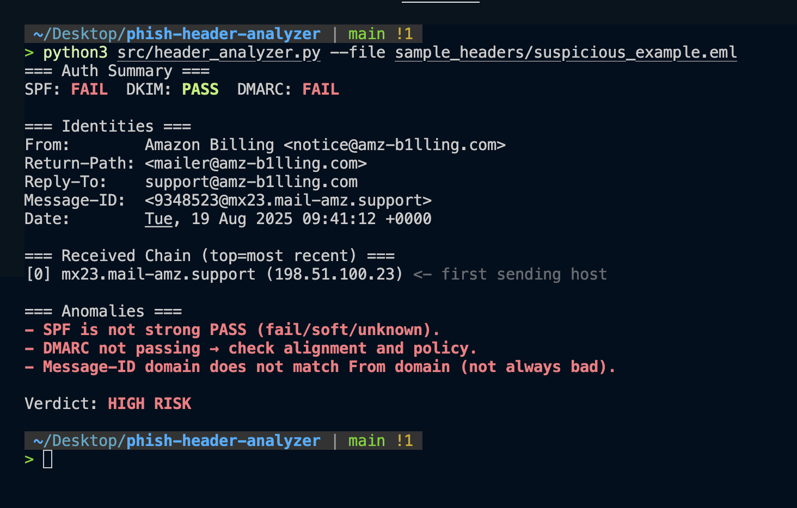

# Phishing Email Header Analyzer

A lightweight CLI tool for **Security / CTI analysts** to triage email headers:

- Summarizes **SPF / DKIM / DMARC** verdicts  
- Maps the **Received** hop chain
- Flags anomalies (domain misalignment, missing headers, lookalikes)  
- Colorized terminal output (green/yellow/red)  
- **No network calls** (safe offline)

---

## Quick Start

```bash
# 1. Create virtual environment & activate
python3 -m venv .venv && source .venv/bin/activate

# 2. Install dependencies
pip install -r requirements.txt

# 3. Run analyzer on a suspicious sample
python src/header_analyzer.py --file sample_headers/suspicious_example.eml

# or analyze via STDIN
cat sample_headers/legit_example.eml | python src/header_analyzer.py

---

## Example Output

Here’s what the analyzer looks like in action:



> Text version available in [assets/demo.txt](> Text version available in [assets/demo.txt](https://github.com/pcbreal/Phishing-Email-Header-Analyzer/blob/main/assets/demo.txt).


---

## Why This Matters

- **Security Analysts**: speeds up header triage, reduces manual inspection time.  
- **CTI Analysts**: normalizes IOCs (domains, IPs, Message-IDs) for enrichment & threat tagging.  
- **SOC Teams**: provides consistent, colorized verdicts that are easy to share in tickets.  

---

## Roadmap

- [ ] Add `--json` export for SIEM/SOAR ingestion  
- [ ] Optional DNS lookups for live DMARC/SPF records  
- [ ] Tiny Flask UI for pasting headers  
- [ ] IOC extractor module (domains, IPs, hashes)  
